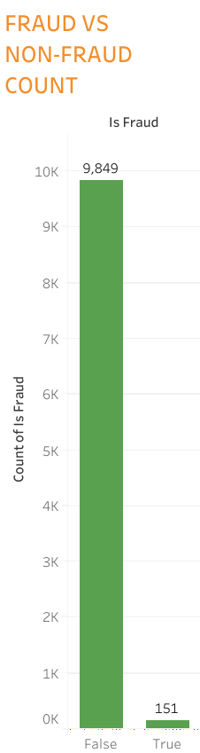
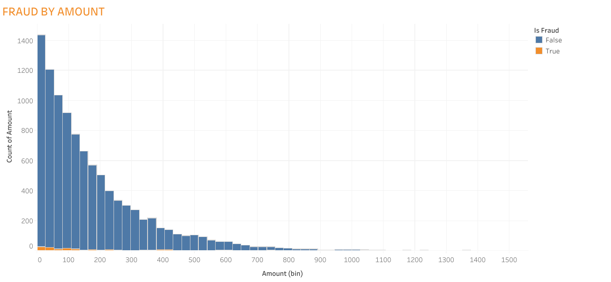
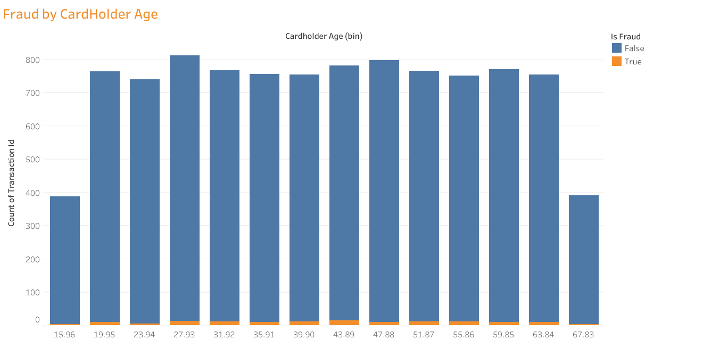
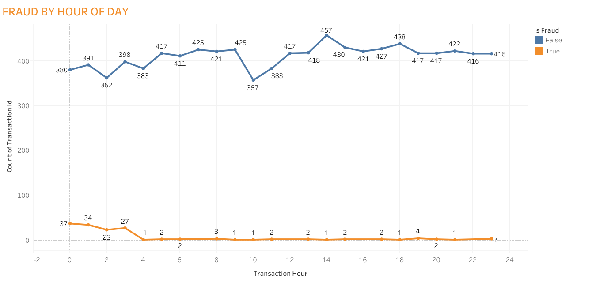
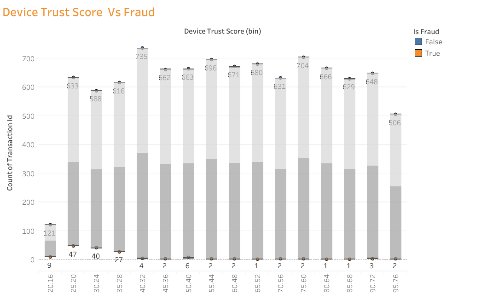
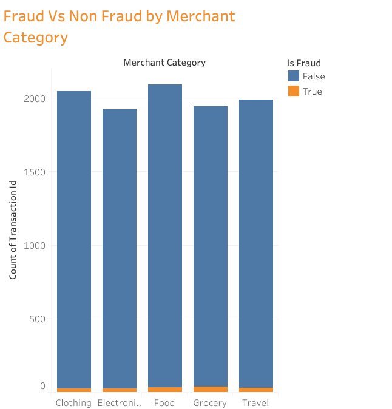
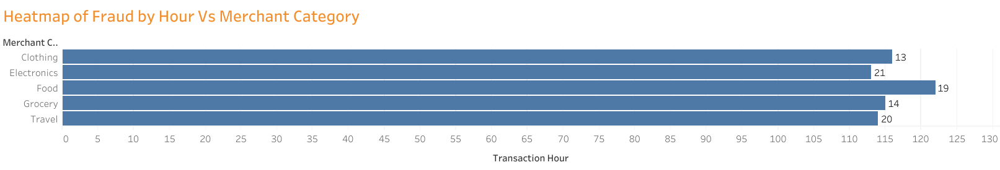
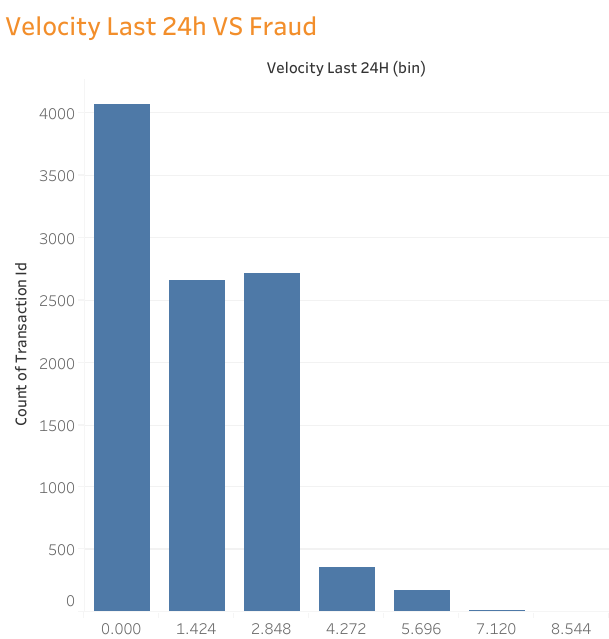

Credit Card Fraud Detection

Data Analysis Project: Credit Card Fraud Detection using Python, SQL, and Tableau Visualizations

Project Overview

This project analyzes credit card transactions to detect potential fraud. Using Python, SQL, and Tableau, the goal is to identify high-risk transactions and create a fraud scoring system.

Key Objectives:

Explore patterns in fraudulent vs non-fraudulent transactions
Detect high-risk transactions using multiple risk indicators
Visualize trends and insights for better decision-making
Dataset

The dataset contains transaction-level information with the following columns:

Column Name	Description
transaction_id	Unique transaction identifier
amount	Transaction amount
transaction_hour	Hour of transaction (0–23)
merchant_category	Merchant type
foreign_transaction	1 if foreign transaction, 0 otherwise
location_mismatch	1 if location differs from usual, 0 otherwise
device_trust_score	Trust score of the device used
velocity_last_24h	Number of transactions in last 24 hours
cardholder_age	Age of cardholder
is_fraud	1 if fraudulent, 0 if not

Location in repo: data/creditcardFraud.csv

Project Structure
Credit_Card_Fraud_Detection/
├─ data/                  # Dataset
├─ notebooks/             # Python / Colab analysis
├─ sql/                   # SQL analysis
├─ visualizations/        # Tableau screenshots
├─ README.md              # Project overview
Python Analysis (notebooks)
Notebook: notebooks/Credit_Card_Fraud_Analysis.ipynb
Steps performed:
Data cleaning and exploration
Fraud pattern analysis
Feature-based fraud scoring
Visualizations using Matplotlib and Seaborn
SQL Analysis
SQL file: sql/creditcardanalysis.sql
Implements fraud scoring using CASE statements and aggregate queries
Example queries include:
Total transactions vs fraudulent transactions
Fraud percentage calculation
Summarized insights per merchant category, transaction hour, or device score
Tableau Visualizations

All screenshots of Tableau dashboards are in: visualizations/

Visual Insights
Fraud vs Non-Fraud Count

Fraud by Transaction Amount

Fraud by Cardholder Age

Fraud by Hour of Day

Device Trust Score vs Fraud

Fraud by Merchant Category

Heatmap: Fraud by Hour vs Merchant Category

Velocity Last 24 Hours vs Fraud

Key Insights
Fraud transactions tend to have higher amounts and higher velocity
Foreign transactions have a higher probability of fraud
Low device trust scores and location mismatches increase risk
Combining multiple features improves fraud detection accuracy
Visualizations confirm patterns and help identify high-risk transactions
Tools & Skills
Python: Pandas, Matplotlib, Seaborn
SQL: Data aggregation, CASE statements, fraud scoring
Tableau: Interactive dashboards, binning, visual insights
GitHub: Version control and portfolio sharing
Data Analysis: Pattern recognition, risk scoring, visualization
